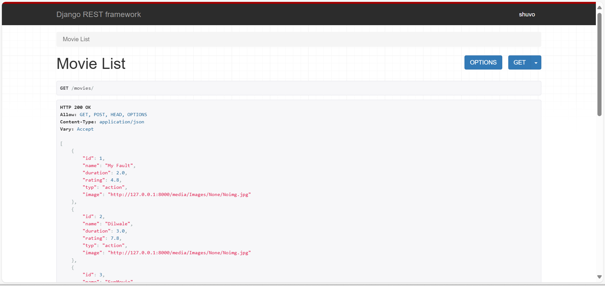
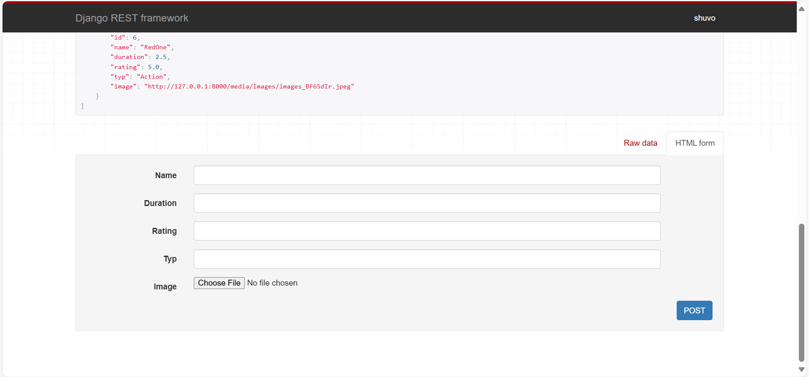
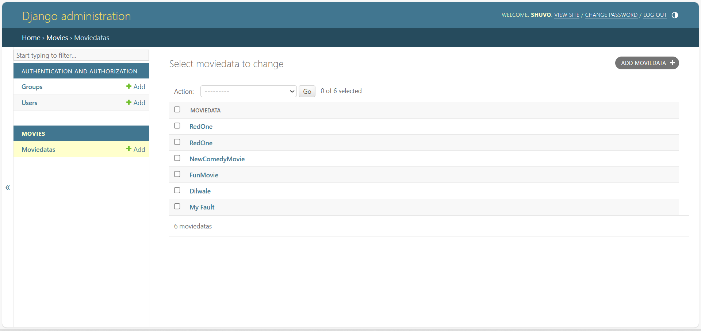

# Movie API Project

This project is a Django REST Framework (DRF) application designed to manage movie-related data, such as name, duration, rating, type, and an image associated with each movie. It includes functionality to perform CRUD (Create, Read, Update, Delete) operations via a REST API interface.

---

## Features

- **REST API for Movies:**
  - Retrieve the list of movies.
  - Add new movies.
  - Update or delete existing movies.
- **Admin Panel Integration:**
  - Manage movie data via the Django admin interface.
- **Media Support:**
  - Upload and serve images associated with movies.

---

## Requirements

- Python 3.x
- Django 4.x
- Django REST Framework
- Pillow (for image handling)

---

## Installation and Setup

1. Clone the repository:
   ```bash
   git clone https://github.com/CoderMahruf/DRF_Movies_API.git
   cd mysite/
   ```

2. Install dependencies:
   ```bash
   pip install -r requirements.txt
   ```

3. Apply database migrations:
   ```bash
   python manage.py makemigrations
   python manage.py migrate
   ```

4. Create a superuser to access the admin panel:
   ```bash
   python manage.py createsuperuser
   ```

5. Run the development server:
   ```bash
   python manage.py runserver
   ```

6. Access the application:
   - API endpoint: [http://127.0.0.1:8000/movies/](http://127.0.0.1:8000/movies/)
   - Admin panel: [http://127.0.0.1:8000/admin/](http://127.0.0.1:8000/admin/)

---

## API Endpoints

### List Movies
- **URL:** `/movies/`
- **Method:** `GET`
- **Response:** List of movies in JSON format.

### Add Movie
- **URL:** `/movies/`
- **Method:** `POST`
- **Request Body:**
  ```json
  {
      "name": "My Fault",
      "duration": 2.0,
      "rating": 4.8,
      "typ": "action",
      "image": "<uploaded-file>"
  }
  ```

### Update/Delete Movie
- **URL:** `/movies/<id>/`
- **Method:** `PUT`, `DELETE`

---

## Usage

### Adding a Movie via Admin Panel
1. Log in to the admin panel at [http://127.0.0.1:8000/admin/](http://127.0.0.1:8000/admin/).
2. Navigate to the `Movies` section and select `Moviedatas`.
3. Add a new movie or edit existing entries.

### Interacting with the API
- Use tools like Postman or cURL to test API endpoints.
- Alternatively, use the built-in API interface provided by DRF for quick testing.

---

## Media Files
Uploaded images are stored in the `media/` directory and served via the API and the Django admin panel.

---

## Screenshots

### API Interface



### Admin Panel


---

## License
This project is licensed under the MIT License.

---

## Author
- **Name:** Mahruful Alam
- **Email:** [mahruf9060@gmail.com]

